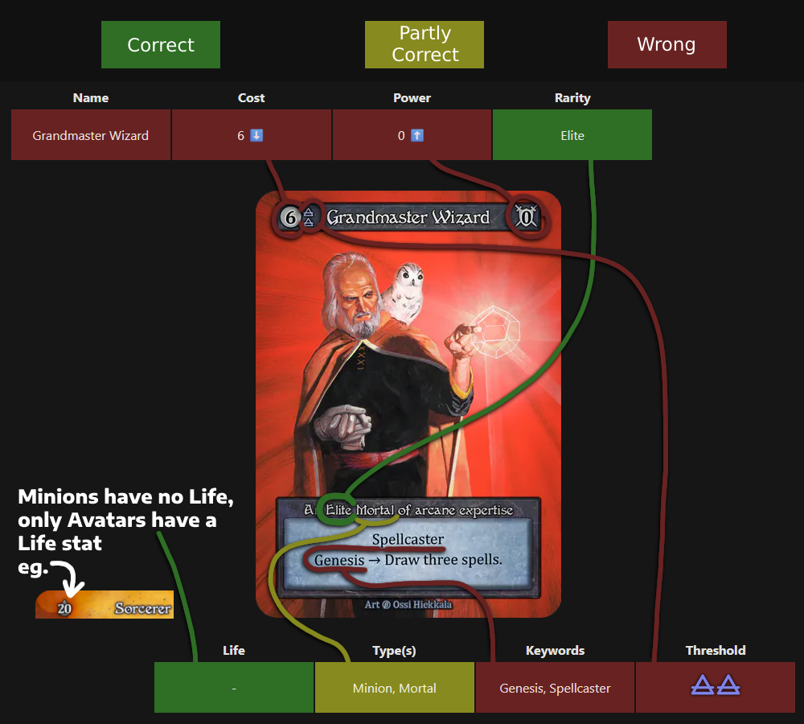
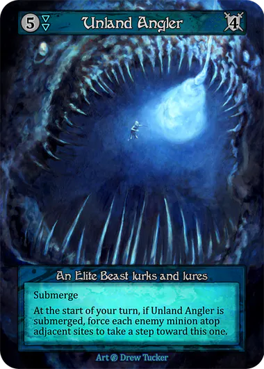

# Sorcerdle
[](https://app.netlify.com/sites/sorcerdle/deploys)

https://sorcerdle.com/

The daily Sorcery: Contested Realms guessing game!

Found a bug? Want a feature? Chuck in an issue!

## How to play

This game works similarly to games like [Gamedle Guess](https://www.gamedle.wtf/guess), there is a target card of the day you must guess, and each guess you make reveals how correct you were to getting today's card!

For example, you have just guessed *Grandmaster Wizard*, here is the breakdown of your guess, with what parts of the card it corresponds to:



We see the following (going in order of the attributes):
```
🟥 It's not `Grandmaster Wizard` 
🟥 It's cost is lower (⬇️) than `6`
🟥 It's power is higher (⬆️) than `0`
🟩 It's rarity is Elite
🟩 It has no Life
🟨 It's types *overlaps* with `Minion, Mortal`
🟥 It's Keywords do not overlap with `Genesis, Spellcaster`
🟥 It's thresholds do not overlap with `☁️☁️`
```

Comparing it to the target card: *Unland Angler*, we see that this is consistent: It is Elite, has no Life stat, and it is a Minion but not a Mortal.
<!--  -->


The full list of Keywords is as follows:
*Airborne, Burrow, Genesis, Charge, Immobile, Disable, Lethal, Movement, Ranged, Spellcaster, Stealth, Submerge, Voidwalk, Landbound, Waterbound, Deathrite, Flood, Projectile, Carry, Nearby, Adjacent, Any mention of specific elemental threshold (eg. Ruby Core)*
